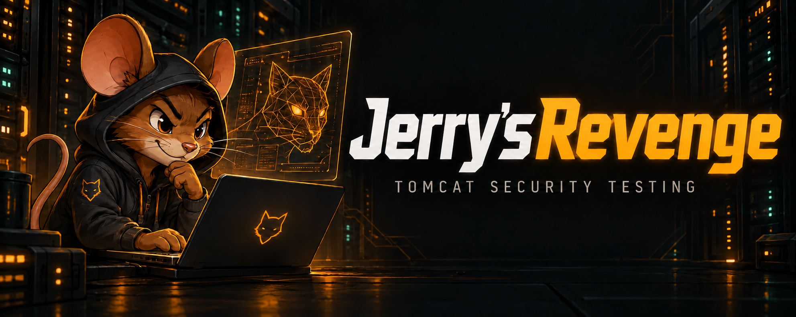

<p align="center">
  
</p>

<h1 align="center">Jerry's Revenge</h1>

<p align="center">
  Evidence-driven Apache Tomcat discovery, enumeration and security auditing tool.
</p>

<p align="center">
  <a href="https://github.com/w41l3r/JerrysRevenge/actions/workflows/ci.yml"></a>
  
  
  
  <a href="./LICENSE"></a>
</p>

> [!IMPORTANT]
> Jerry's Revenge is intended only for systems you own or are explicitly
> authorized to assess. Credential testing, access-control checks, and
> deployment validation are active and detectable operations. Ghostcat file
> acquisition is also active exploitation and may retrieve sensitive data. The
> default run is a zero-traffic plan; HTTP or AJP target requests require
> `--execute`.

Jerry's Revenge is a Go CLI for authorized Apache Tomcat assessments. It
correlates multiple HTTP signals instead of trusting a port number or a single
banner, checks the Manager surface, supports bounded credential validation, and
can prove Manager deployment capability with a temporary static canary. Every
identified version receives a local CVE-2020-1938 applicability assessment;
an explicitly selected Ghostcat mode can perform one bounded AJP file-read
validation and preserve the returned bytes as restricted evidence.

The tool does **not** execute commands, deploy JSPs, create web shells, establish
callbacks, or provide persistence. The legacy `-e/--exploit` option performs
only the reversible static-canary workflow documented below.

## Highlights

| Capability | What it does |
|---|---|
| Tomcat fingerprinting | Correlates the base page, a controlled 404, documentation markers, headers, realms, and version evidence. |
| Manager discovery | Checks `/manager/html` without treating a status code alone as proof. |
| Proxy/Tomcat path differential | Optionally tests two semicolon path-parameter variants while preserving raw request paths. |
| Credential validation | Includes an auditable Tomcat corpus, optional company-derived candidates, bounded concurrency, delay, an invalid-control request, rate-limit handling, and stop-on-success. |
| Deployment proof | Uploads a one-file static WAR through Manager HTML, verifies a random marker, and immediately undeploys it. |
| Ghostcat assessment | Always correlates an identified version with CVE-2020-1938 and optionally performs one explicitly scoped AJP file-read request. |
| Evidence-first output | Produces a chronological sanitized runbook and isolates confirmed credentials in a mode-`0600` inventory. |
| Safe execution model | Plans first, follows no redirects, retries nothing automatically, ignores environment proxies, and caps response bodies. |

## Quick start

Requirements: Go 1.24 or a compatible newer release. The project uses only the
Go standard library.

```bash
git clone https://github.com/w41l3r/JerrysRevenge.git
cd JerrysRevenge
make build
```

Generate a plan. This command sends **no HTTP or AJP requests**:

```bash
bin/jerrysrevenge -u https://tomcat.example:8443
```

Review the printed scope, request ceiling, telemetry, risks, and report. Run the
same operation only after confirming authorization:

```bash
bin/jerrysrevenge -u https://tomcat.example:8443 --execute
```

All hostnames and credentials in this README are placeholders. No example below
was executed against those destinations.

## Common workflows

### Discover Tomcat and its Manager surface

```bash
bin/jerrysrevenge \
  --url https://tomcat.example:8443 \
  --delay 250ms
```

Add `--execute` only after reviewing the plan.

For multiple targets, provide one complete HTTP(S) base URL per line:

```bash
bin/jerrysrevenge --list targets.txt --threads 4 --delay 250ms --execute
```

### Test semicolon path-parameter variants

```bash
bin/jerrysrevenge \
  --url https://tomcat.example:8443 \
  --trybypass \
  --execute
```

The variants are sent only after Tomcat evidence is present:

```text
/jr/..;/manager/html
/;a=b/manager/html
```

The tool reports changed routing only when the response contains unambiguous
Manager evidence and differs materially from the direct path. Acceptance of a
variant is not automatically reported as an access-control bypass.

### Validate Manager credentials

The preferred wordlist format is one pair per line:

```text
username:password
```

`username password` is also accepted. Blank lines, `#` comments, and duplicate
pairs are ignored; passwords in colon format may contain additional colons.

`--brute` uses the embedded
[`wordlists/tomcat-common.txt`](wordlists/tomcat-common.txt) corpus when no
`--wordlist` is supplied. The 113-pair bundled list retains the complete local
SecLists Tomcat corpus used during development, adds selected Metasploit and
weak lab/appliance combinations, contains `tomcat:root`, and travels inside the
compiled binary. Supplying `--wordlist` replaces the bundled base list.

```bash
bin/jerrysrevenge \
  --url https://tomcat.example:8443 \
  --brute \
  --wordlist manager-userpass.txt \
  --threads 4 \
  --delay 500ms \
  --execute
```

The default is to stop after the first `CONFIRMED` credential. Use
`--continue-on-success` to process the remaining candidates. Before trying the
wordlist, Jerry's Revenge sends one intentionally invalid credential and
requires the endpoint to respond with an unambiguous Basic challenge. HTTP
`429` stops new attempts for that target.

Use `--company` to add a deterministic, in-memory set of organization-derived
user/password candidates to either base list:

```bash
bin/jerrysrevenge \
  --url https://tomcat.example:8443 \
  --brute \
  --company "Example Corporation"
```

The generator combines normalized company tokens with common username, case,
leet, suffix, and current/previous-year patterns. It is capped at 512 added
pairs, reports only candidate counts, and redacts the company argument from the
sanitized runbook. Review the dry-run request ceiling before adding `--execute`.

### Run the reversible deployment canary

Prefer a mode-`0600` credential file containing exactly one
`username:password` pair:

```bash
chmod 600 manager-credential.txt

bin/jerrysrevenge \
  --url https://tomcat.example:8443 \
  --exploit \
  --creds-file manager-credential.txt \
  --execute
```

Direct `--username/-U` and `--password/-P` arguments are supported, but a
command-line password may be visible to other local users through process
inspection.

Credential validation and the canary can be chained. Only the first
`CONFIRMED` credential is eligible for deployment:

```bash
bin/jerrysrevenge \
  --url https://tomcat.example:8443 \
  --brute \
  --wordlist manager-userpass.txt \
  --exploit \
  --execute
```

An `INFERRED` `401 -> 403` transition is never used automatically for upload.

## How discovery works

For each target, the base workflow evaluates:

1. `GET` on the supplied base URL;
2. `GET` on a deterministic controlled-404 path;
3. `GET /docs/`;
4. `GET /manager/html`.

The fingerprint combines evidence such as Apache Coyote headers, default Tomcat
titles and error pages, documentation markers, exposed version strings, and the
`Tomcat Manager Application` realm. Reverse proxies and customized error pages
can hide or mix these signals, so results are classified by confidence rather
than forced into a yes/no answer.

## CVE-2020-1938 / Ghostcat

Every completed discovery run records an offline CVE-2020-1938 assessment when
it can identify a precise Tomcat version. This comparison sends no extra
request and never treats a version match as proof of AJP exposure or
exploitability. EOL branches that are not explicitly covered by the Apache
advisory remain `UNVERIFIED` rather than being guessed.

Active validation is opt-in. `--ghostcat` adds exactly one AJP13
`FORWARD_REQUEST` per target, with no retry. It defaults to the target hostname,
port `8009`, and the web-application-relative file `WEB-INF/web.xml`:

```bash
bin/jerrysrevenge \
  --url https://tomcat.example:8443 \
  --ghostcat \
  --ajp-host 10.0.0.25 \
  --ajp-port 8009 \
  --ghostcat-file WEB-INF/web.xml
```

With `--list`, each URL's hostname becomes that target's AJP hostname.
`--ajp-host` is intentionally accepted only with a single `--url`, preventing
one override from silently redirecting a multi-target run.

The first invocation remains a zero-traffic plan. Add `--execute` only after
separately confirming that the AJP host, port, file, and acquisition are within
scope. A successful response is sensitive-data acquisition: raw bytes are
written to a new mode-`0600` file below the mode-`0700`
`--ghostcat-output-dir`, while terminal output and the sanitized report contain
only protocol metadata, byte count, SHA-256, and the restricted path. Input
paths reject URLs, literal or percent-encoded traversal, path parameters, query
strings, fragments, backslashes, controls, and empty path segments; responses
are capped at 1 MiB. The default `WEB-INF/web.xml` is confirmed only when XML
web-application markers are present. For another selected file, plausible body
bytes are preserved but the exact identity remains `INFERRED` until the
operator reviews the restricted evidence.

This mode does not upload content, evaluate JSP, execute commands, establish a
callback, or collect multiple files. See the
[loopback-only Docker lab](lab/ghostcat/README.md) for a reproducible validation
fixture. Protocol and vulnerability references: [Apache AJP13
specification](https://tomcat.apache.org/connectors-doc/ajp/ajpv13a.html),
[Apache advisory](https://www.mail-archive.com/announce@tomcat.apache.org/msg00398.html),
and the operator-selected [Ghostcat lab
article](https://medium.com/@deepanshu_khanna/ghostcat-pwn-when-an-old-tomcat-vulnerability-opens-the-org-doors-62406effeed0).

## Static deployment-canary workflow

The deployment check uses the authenticated, CSRF-protected Manager HTML
interface—the same `manager-gui` surface against which the credential is
validated:

1. authenticate to `/manager/html` and retain the session cookie in memory;
2. parse the Manager CSRF nonce;
3. upload the static WAR as multipart field `deployWar`;
4. retrieve the generated context and verify its random marker;
5. refresh the Manager session and CSRF state;
6. immediately send the undeploy request.

Cleanup is attempted even when marker verification fails. A cleanup failure
returns exit status `1` and identifies the context requiring manual review.
Session cookies, CSRF values, Basic credentials, and raw Manager pages are never
written to the sanitized report.

The transport sequence follows the Manager HTML mechanics used by Rapid7's
[`exploit/multi/http/tomcat_mgr_upload`](https://github.com/rapid7/metasploit-framework/blob/master/modules/exploits/multi/http/tomcat_mgr_upload.rb),
but replaces its executable payload with a constrained static artifact.

### Custom `--war-file`

The built-in WAR is generated in memory and contains only a static `index.html`.
If `--war-file` is supplied, the archive must pass all of these local checks
before any request can be sent:

- regular, non-symlink file no larger than 64 KiB;
- valid ZIP/WAR with exactly one regular entry named `index.html`;
- exact canonical static-canary HTML structure;
- 12–64 character token containing only letters, digits, dots, underscores, or
  hyphens.

The accepted input is repacked into a deterministic one-entry ZIP before
upload. JSPs, classes, JARs, JavaScript, `WEB-INF`, native files, traversal
paths, symlinks, trailing data, and any additional entry are rejected.

## Safety controls

- Dry-run is the default; only `--execute` permits target traffic.
- Redirects are recorded but never followed.
- Requests are never retried automatically.
- `--threads` is a global concurrency ceiling.
- `--delay` applies globally between request starts.
- Environment proxy variables are ignored to avoid accidental scope expansion.
- HTTP response bodies are limited to 1 MiB and are not persisted verbatim;
  Ghostcat raw bytes use the restricted-evidence exception below.
- Authorization values, cookies, passwords, and CSRF nonces are excluded from
  normal output and reports.
- Credential findings are isolated from the sanitized report.
- Company-derived credential values are generated in memory and omitted from
  normal output and sanitized reports.
- Ghostcat is never active unless both `--ghostcat` and `--execute` are present;
  it sends one AJP request per target with no retry.
- Raw Ghostcat response bytes are stored only as mode-`0600` restricted
  evidence; normal output carries metadata and a hash.
- Deployment never reuses a semicolon bypass path.
- The canary contains no server-side executable content.

## Reports and credential handling

Every run creates a chronological Markdown runbook:

```text
reports/jerrysrevenge-<timestamp>.md
```

It records objectives, exact sanitized operations, captured results,
interpretation, limitations, execution status, dependencies, and confidence.
The supported classifications are `CONFIRMED`, `INFERRED`, `POTENTIAL`, and
`UNVERIFIED`; steps are marked `EXECUTED` or `EVALUATED — NOT EXECUTED`.

Confirmed credential values are written only to:

```text
restricted/jerrysrevenge-credentials.jsonl
```

The inventory is created with mode `0600`. Both directories are ignored by
Git and must remain outside normal report exports and shared evidence bundles.
Use `--report` and `--credential-inventory` to select different locations.

Successful Ghostcat response bodies are kept separately under
`restricted/ghostcat/` by default. Treat those files as acquired target data;
do not add them to source control or ordinary evidence bundles.

## CLI reference

| Option | Purpose |
|---|---|
| `-u, --url URL` | Assess one HTTP(S) base URL. |
| `-l, --list FILE` | Read one base URL per line. |
| `--trybypass` | Test the two semicolon path variants. |
| `-b, --brute` | Enable Manager credential validation. |
| `-w, --wordlist FILE` | Replace the bundled `username:password` candidate list. |
| `--company NAME` | Add a bounded set of organization-derived candidates; requires `--brute`. |
| `-t, --threads N` | Set the global concurrent-request limit; default `4`. |
| `--continue-on-success` | Continue after a confirmed credential. |
| `--ghostcat` | Request one explicitly authorized AJP file-read validation per target. |
| `--ghostcat-file PATH` | Select a web-application-relative file; default `WEB-INF/web.xml`. |
| `--ghostcat-output-dir DIR` | Select the restricted evidence directory; default `restricted/ghostcat`. |
| `--ajp-host HOST` | Override the AJP hostname for a single `--url` target. |
| `--ajp-port PORT` | Select the AJP port; default `8009`. |
| `-e, --exploit` | Run the reversible static deployment-canary check. |
| `-U, --username USER` | Supply a direct Manager username for the canary. |
| `-P, --password VALUE` | Supply a direct Manager password; visible in process arguments. |
| `--creds-file FILE` | Read one `username:password` pair for the canary. |
| `--war-file FILE` | Use a locally validated canonical static-canary WAR. |
| `--timeout DURATION` | Set the per-request timeout; default `10s`. |
| `--delay DURATION` | Set the minimum interval between request starts. |
| `-k, --insecure` | Accept invalid TLS certificates. |
| `--report FILE` | Select a new sanitized report path. |
| `--credential-inventory FILE` | Select the restricted credential inventory. |
| `--user-agent VALUE` | Override the HTTP User-Agent. |
| `--execute` | Confirm authorization and permit the planned requests. |
| `--version` | Display the tool version. |

Run `bin/jerrysrevenge --help` for the authoritative options of the installed
version.

## AI-agent integration

The repository includes an opt-in `tomcat-enumeration` skill under
`.agents/skills/tomcat-enumeration/`, plus shared instructions for Codex, Claude
Code, and compatible agents. An agent must ask the operator before loading the
skill, and skill consent never authorizes target traffic.

After Tomcat version identification, the skill can coordinate passive CVE
research through a dedicated subagent. It retains CVEs with an authoritative
CVSS base score greater than `6.0`, ranks them by severity, checks prerequisites,
and distinguishes confirmed public PoCs from unverified claims. It may identify
a PoC but must not download or run one without separate approval.

## Development

```bash
make test
make vet
make build
```

HTTP tests use ephemeral loopback listeners only. See
[`docs/validation.md`](docs/validation.md) for the validation strategy,
[`CONTRIBUTING.md`](CONTRIBUTING.md) for contribution requirements, and
[`SECURITY.md`](SECURITY.md) for responsible disclosure.

## Roadmap

Explicit workflow selection and possible future AJP shared-secret support are
tracked in [`ROADMAP.md`](ROADMAP.md). Implemented Ghostcat file-read support
still requires the explicit `--ghostcat --execute` gate and separate scope for
the AJP endpoint and selected resource.

## Current limitations

- AJP support is limited to one explicitly selected Ghostcat file-read request;
  there is no general AJP, JMX/RMI, or adjacent-service scanner.
- Ghostcat shared-secret authentication and virtual-host/context selection are
  not implemented.
- There is no broad directory discovery or form-login support.
- Reverse proxies, custom pages, and caches can obscure version evidence.
- A few already in-flight requests may finish after another worker confirms a
  credential.
- Credential strings remain in process memory; Go cannot guarantee wiping
  immutable strings.
- Deployment uses direct Manager HTML paths and never attempts bypass-assisted
  authentication, upload, or cleanup.
- `UNVERIFIED` means insufficient evidence—not proof that a surface is absent.

## Legal and ethical use

You are responsible for obtaining explicit authorization, defining scope, and
complying with applicable law. Jerry's Revenge is designed to make active
behavior visible and reviewable; it cannot determine whether you are authorized
to test a system.

## License

Jerry's Revenge is released under the [MIT License](LICENSE).
